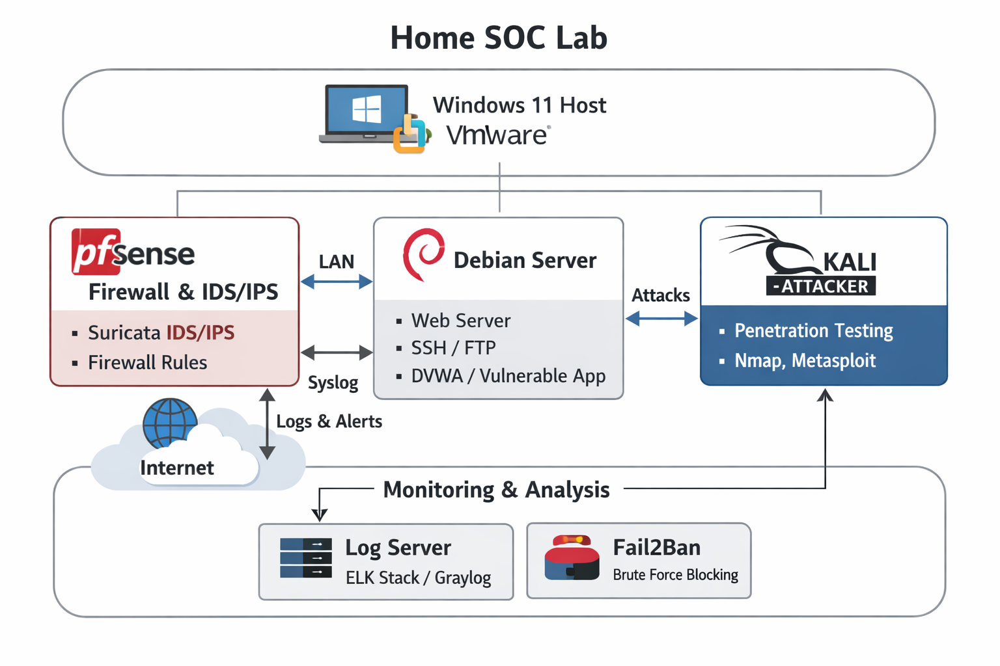

\# 🏠 Home Lab — pfSense + Debian + Kali Linux

\## Overview / Überblick

A virtual security lab built entirely from scratch on VMware Workstation.

Configured a pfSense firewall, Debian Linux server, and Kali Linux

attack machine — all connected through a private virtual network.

Ein virtuelles Sicherheitslabor, das von Grund auf mit VMware Workstation

aufgebaut wurde. pfSense-Firewall, Debian-Linux-Server und Kali Linux

als Angriffsmaschine — alle über ein privates virtuelles Netzwerk verbunden.

\---

\## Network Architecture / Netzwerkarchitektur

